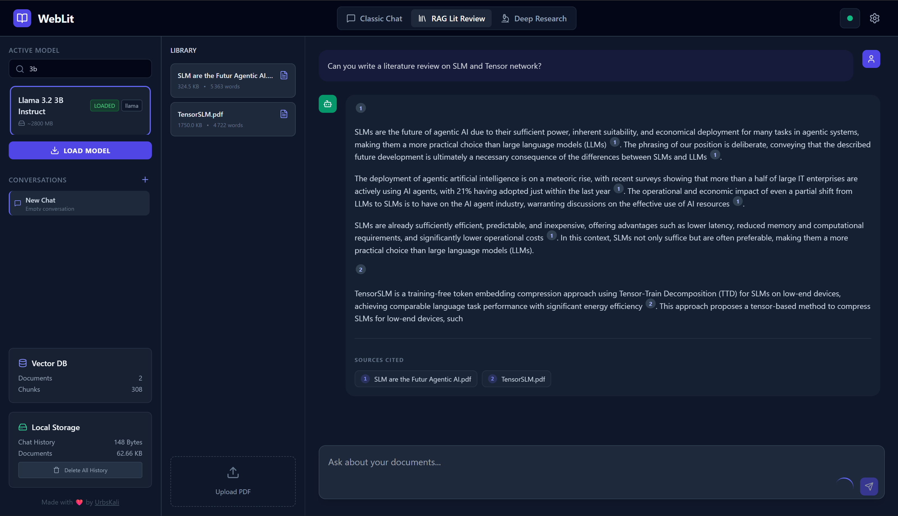

# WebLit

WebLit is a privacy-first, client-side application for literature review and research assistants. It leverages WebGPU to run Large Language Models (LLMs) entirely within your browser, ensuring that **no data ever leaves your device**.

## Architecture Overview

The project is built using modular Vanilla JavaScript (ES Modules) without complex build steps, making it lightweight and easy to audit.

### Core Components
*   **WebLLM (`src/core/LLMHandler.js`)**: Powers the inference engine using local LLMs (like Llama 3, Phi-3, etc.) via WebGPU.
*   **Transformers.js (`src/core/embedding.js`)**: Handles local semantic embeddings for vector search.
*   **PDF.js (`src/core/pdfParser.js`)**: Handles client-side PDF text extraction.
*   **Local VectorDB (`src/core/vectorDB.js`)**: A custom-implemented in-memory vector store for managing document embeddings.

---

## RAG (Retrieval-Augmented Generation) Pipeline

The RAG functionality is the heart of the "Literature Review" tab (`src/ui/components/tabs/ragTab.js`). It is designed to provide high-quality, citation-backed answers from your uploaded PDF documents.

### 1. Document Parsing & Smart Cleaning

To ensure the LLM retrieves high-quality context and isn't distracted by academic formatting noise, the PDF parsing process (`src/core/pdfParser.js`) includes a rigorous cleaning step:

*   **Removal of Citations**: Reference markers like `[1]`, `[12, 14]`, or `(Author et al., 2020)` are stripped. This prevents the vector search from retrieving chunks based solely on shared citation numbers rather than content.
*   **De-Cluttering**: Elements that break semantic flow are removed:
    *   Figure captions (e.g., `Figure 1:`).
    *   URLs (DOI links, ArXiv URLs).
    *   Email addresses.
    *   Specific ArXiv IDs.
*   **Bibliography Truncation**: The parser attempts to detect the "References" or "Bibliography" section and removes everything following it, ensuring the LLM doesn't cite the bibliography itself as a source of truth.

### 2. Intelligent Summarization (Auto-Abstracting)

Before hitting the vector database, WebLit creates a semantic map of your library:

*   **Content Compression**: During the upload phase, the first 10,000 characters of the document are sent to the local LLM.
*   **Abstract Generation**: The LLM generates a rich abstract summarizing the core topics of the paper, with more detail than a typical summary.
*   **Metadata Tagging**: This abstract is embedded into the metadata of *every chunk* of that document. This allows the system to understand the high-level context of a chunk even if the specific keyword is missing from that small text segment.

### 3. Search Optimization (Pre-Prompting)

A simple vector search often fails when the user's question doesn't lexically match the document phrasing. WebLit implements a **Query Rewriting** step to solve this:

*   **The Problem**: A user asks "How does the model handle noise?" but the paper discusses "robustness to perturbations." A direct search might miss the relevant section.
*   **The Solution**: Before searching, WebLit uses the active LLM to generate improved search queries using the **document abstracts**.
*   **Mechanism**:
    1.  The system bundles the user's question with the **generated abstracts** of all uploaded documents.
    2.  It sends a **System Pre-Prompt** to the LLM acting as an "Expert Search Query Optimizer".
    3.  The prompt instructs the model to generate **3 distinct, keyword-rich search queries** tailored to the specific topics found in your library.
    4.  These 3 queries + the original question are executed in parallel against the VectorDB.
    5.  Results are de-duplicated and re-ranked to form the final context.

### 4. Context Construction & Generation

*   The 10 top retrieved chunks are assembled into a context window.
*   The context is injected into the system prompt.
*   The LLM generates an answer, with the UI handling citation rendering (converting `[1]` markers into interactive tooltips).
---

## Chat System & History

WebLit includes a robust "Classic Chat" mode (`src/ui/components/tabs/chatTab.js`) that persists your conversations locally.

### 1. Session Management
The `ChatHistoryManager` (`src/core/chatHistory.js`) orchestrates conversation storage:
*   **Multi-Session Support**: You can create multiple distinct chat threads.
*   **Auto-Saving**: Messages are saved to `localStorage` immediately upon generation.
*   **Session Metadata**: Each session tracks its creation time, title, and a preview of the last message.

### 2. Local Storage Structure
To maintain privacy while enabling persistence, data is structured as follows in your browser's Local Storage:
*   `weblit_sessions`: An index list of all chat sessions (IDs, titles, timestamps).
*   `weblit_session_{UUID}`: The actual array of messages (User/Assistant exchanges) for a specific session.

### 4. Smart Session Renaming
After the first exchange in a new chat, WebLit automatically generates a concise, keyword-rich title for the session.
*   **Mechanism**: A specialized system prompt instructs the ongoing LLM instance to summarize the topic based on the initial user-assistant turn.
*   **Privacy**: This happens entirely locally; no text is sent to external servers for summarization.

## Configuration & Customization

WebLit offers a dedicated **Settings-Modal** (accessible via the sidebar) to fine-tune the experience without touching code.

### 1. LLM Behavior
*   **System Prompts**: You can edit the base system instructions for both the "Classic Chat" and the "RAG/Literature Review" modes. This allows you to change the persona or strictness of the AI.
*   **Inference Parameters**: Adjust `Temperature` (creativity) and `Top P` controls.

### 2. RAG Tuning
*   **Embedding Model Selection**: Switch between different quantized models (e.g., `Xenova/all-MiniLM-L6-v2`) to balance performance and accuracy.
*   **Chunking Strategy**: Customize `Chunk Size` and `Overlap` to optimize how PDF text is split before being stored in the VectorDB.

### 3. Markdown Support
The chat interface fully supports Markdown rendering, including code blocks, lists, and bold/italic formatting, ensuring technical discussions are easy to read.

### Plans for Deep Research Integration

Future versions of WebLit aim to integrate with academic databases (like Semantic Scholar, PubMed, arXiv) to allow users to directly search and import papers into their local library, further streamlining the research workflow and enhancing the depth of research capabilities.

I planned to do it using an web extension that can open tab and fetch content from these sites. This approach ensures that I comply with the school grading as it should be only client-side code. 

